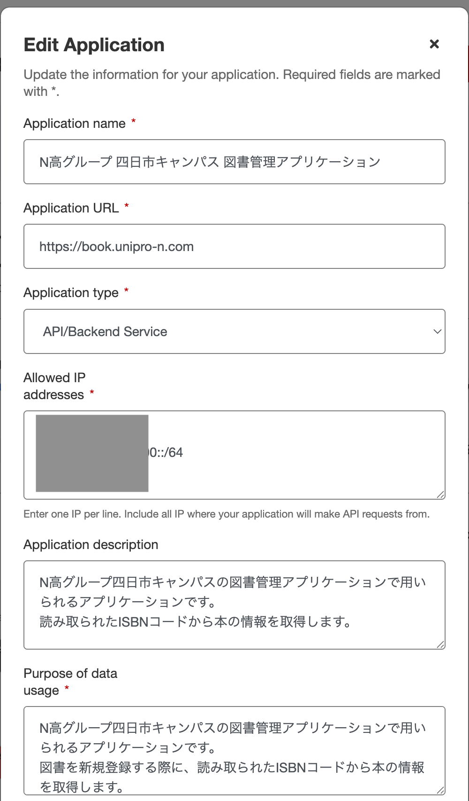
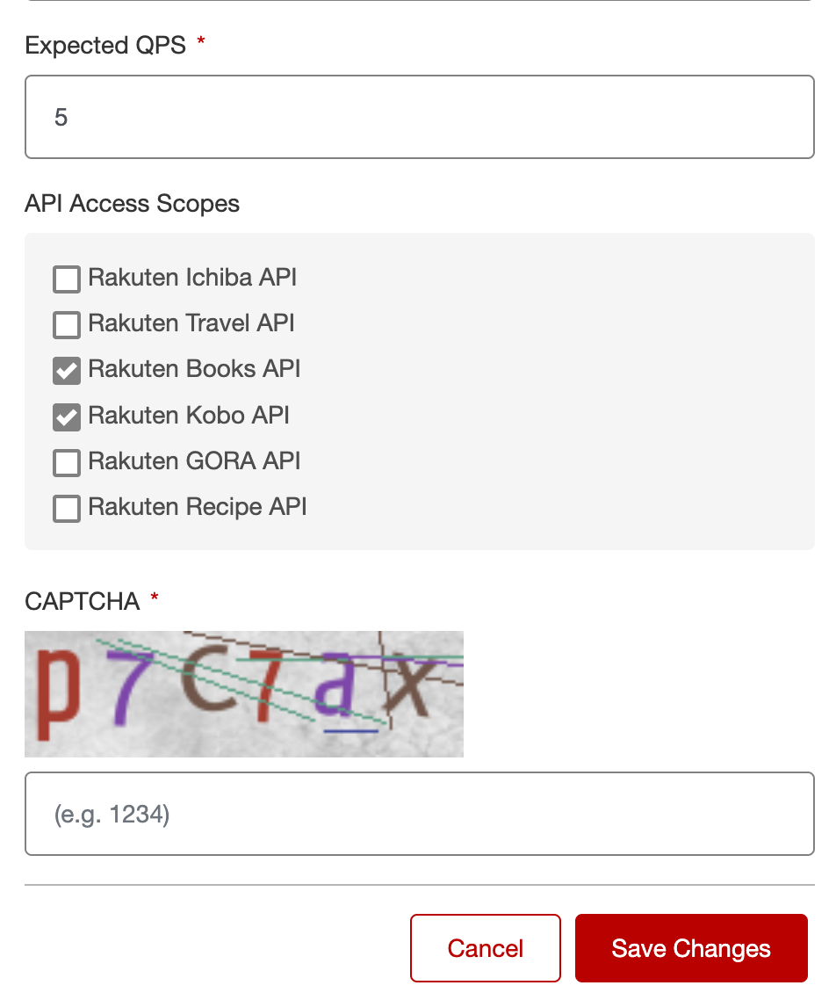

# 図書システム(名称未定)

## 開発方法

1. `bun i`
2. `docker compose up -d`
3. \_envファイルを.envにコピー
4. 各環境変数を埋める
   1. BETTERAUTH_SECRET - ランダムな英数字の羅列を挿入
   2. GOOGLE_CLIENT_ID / SECRET - Google API PlatformのClient ID / Secretです。詳しくは後述します。
   3. BETTER_AUTH_URL - 動かすURLを入力
   4. ~~DATABASE_URL - DBのURI。デフォルトでdocker-compose.yamlを動かした場合のものを入力済み~~ (廃止済み)
   5. SMTP*HOST / SMT*... - メールの設定。パスワードリセットやメール認証で用いられます。
   6. RAKUTEN_APP_ID / KEY - 楽天APIの設定です。これを設定することにより、ISBNコードの検索が容易になります。詳しくは後述します。
   7. PHP_CRUD_API_URL / APIKEY - PHP CRUD APIの設定です。後述します。
5. `prisma generate`
6. `prisma migrate dev`
7. `bun dev`

## PullRequestの送信について

適切な説明を入力して送信してください。

## Google OAuth 2.0 / OIDC について

Google Client ID等については下記記事を参考にしてください。

https://zenn.dev/milky/articles/google-client-oauth

## Rakuten API について

このプロジェクトでは、ISBNコードから図書情報を取得し、円滑に書籍の登録ができるよう、Rakuten Books APIを使用しています。
下記の通りに設定してください。

> [!IMPORTANT]
> IPアドレス(特にIPv6)は、なるべく公開しないようにしましょう。
> 不正アクセスの温床になる場合があります。

1. [Rakuten Developers のページ](https://webservice.rakuten.co.jp/) にアクセスします。
2. 右上のNew Appsをクリックし、必要に応じて楽天アカウントでログインします。
3. 利用規約をよく読んだ上で、同意し、下記の通りにフォームに入力します。(右上に日本語ボタンがあります。)
4. 下記のように入力してください。(画像は編集画面ですが、新規作成時も同じです。)

### IPアドレスについて

開発環境やデプロイ先(本番環境)などのAPIのアクセス元のIPアドレスが必要になります。
これは、セキュリティ上の理由から楽天が設けているものです。

> [!IMPORTANT]
> IPアドレスは、なるべく公開しないようにしましょう。
> 不正アクセスの温床になる場合があります。

> [!NOTE]
> IPアドレスはたまに変わることがあります。
> エラーが出るようになったら、確認してみましょう。
> キャンパスのWiFiは特殊な設定なのでわかりませんが、一般的な家庭のネットワークであれば1年に1回も変わらないでしょう。
> また、デプロイ先(本番環境)は管理ページ(ダッシュボード)に記載があったりします。

IPアドレスの確認には、下記サイトを使いましょう。

1. 下記サイトへアクセス
2. 右上の「ヘルプデスクの方へ」をクリックして、OtherSitesが全てgoodになるまで待つ
3. IPv4、v6をコピーする。(v6はないこともある。)

<https://test-ipv6.com/index.html.ja_JP>

また、IPv6については、端末ごとに割り当てられるため、下記のように **最初の4セクションのみを抜き出し、::/64をつけて** 指定しましょう。

例: `2001:0db8:1234:5678:90ab:cdef:0000:0000`

この場合は、5678が4セクションめなので、

指定例: `2001:0db8:1234:5678::/64`

となります。 **末尾に/64のみならず、:が2つあることを確認してください！**

## PHP CRUD APIについて

本プロジェクトでは、LolipopをDBとして用いるため、PHP CRUD APIというライブラリを用いています。
phpディレクトリ内のprod.phpをlolipop上にデプロイし、ファイル最下部のDBの設定を変更してください。

また、ローカルで開発する際は、docker-compose.yamlを用いてください。

> [!IMPORTANT]
> これは**DBマイグレーションを自動で行いません**。
> そのため、dbディレクトリ内のSQLファイルを手動で適用する必要があります。

詳しくは、こちらのリポジトリをご確認ください。

[mevdschee/php-crud-api](https://github.com/mevdschee/php-crud-api)

### 開発向けDBの提供について

四日市キャンパス生のみ、開発用にDBを提供しています。

あかつきゆいと宛にお問い合わせください。
