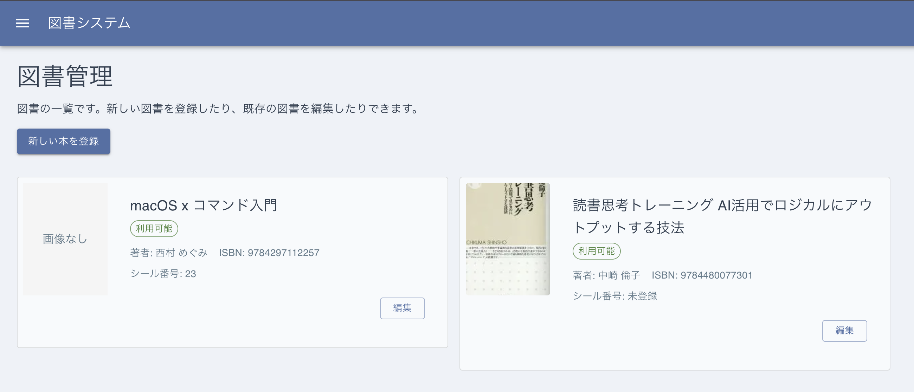
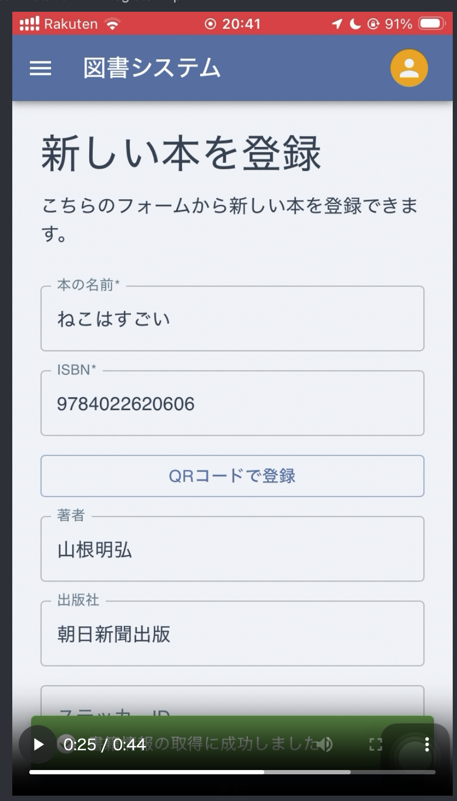
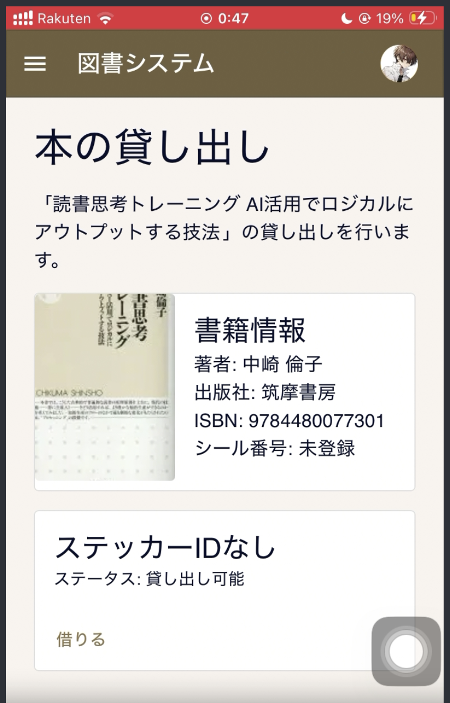

---
# try also 'default' to start simple
theme: default
# random image from a curated Unsplash collection by Anthony
# like them? see https://unsplash.com/collections/94734566/slidev
background: white
# some information about your slides (markdown enabled)
title: 図書管理システム導入のススメ
info: |
  ## 図書管理システムのススメ
  N高グループ四日市キャンパスに導入してもらうための提案資料
# apply UnoCSS classes to the current slide
class: text-center
# https://sli.dev/features/drawing
drawings:
  persist: false
# slide transition: https://sli.dev/guide/animations.html#slide-transitions
transition: slide-left
# enable Comark Syntax: https://comark.dev/syntax/markdown
comark: true
# duration of the presentation
duration: 35min
layout: intro
colorSchema: light
hideInToc: true
---

# 図書管理システム導入提案

四日市キャンパス向け図書管理システム導入の提案

 

提案日: 2026-04-05  
対象: 教職員

---
layout: section
---

# 1. 提案の背景

---
hideInToc: true
---

# 現状の課題

- 貸出・返却の記録が手動/口頭で、追跡性が低い
- 貸出の仕組みを知らない人や手続きが面倒で使ってない人が大勢いるため、 ちょっとした工夫で利用を大きく活性化できるはず

---
hideInToc: true
---

# 提案のゴール

1. 貸出・返却をバーコード中心で高速化する
2. 貸出の利用を活性化し、貸出・返却をより身近にする
3. 返却期限ルールの明確化と通知運用で未返却率を下げる
4. 生徒主体で開発を行うことでスキル向上と知見を広げる

---
layout: section
---

# 2. システム概要

---
hide: true
hideInToc: true
---

# 既存実装から見た強み

- Next.js + React + Prisma + PostgreSQL で実装済み
- Better Auth による統合認証
- 学生/管理者のロールベース権限制御
- バーコード読み取りによる貸出・返却・新規登録導線
- 楽天Books API連携でISBNから書誌情報補完
- PWA + Web Push による端末通知基盤
- Docker/ArgoCD/Kubernetes 前提のデプロイ構成あり

---

# 使用例: 管理画面

図書管理画面では、登録されている本の登録・編集・確認などができるほか、 ユーザーの追加・確認・編集・削除などができます。

---
layout: two-cols
---

::left::

# 使用例: 本の登録

本の登録画面では、ISBNバーコードを読み取ることにより、本の情報を自動入力できます。

::right::

---
layout: two-cols
---

::left::

# 使用例: 本の貸し出し

本の貸し出し画面では、バーコードから本を 検索し貸し出し処理を行えます。 
また、同じ本が複数ある場合でも、 シールの番号(ステッカーID)で判別することが できます。

::right::

---
hideInToc: true
---

# 利用者別の運用イメージ

| 利用者       | 主な操作                         | 効果                       |
| ------------ | -------------------------------- | -------------------------- |
| 学生         | サインイン、貸出、返却、通知購読 | 手続き短縮、返却忘れ防止   |
| 管理者(職員) | ユーザー管理、運用設定、初期化   | 管理強化、監査対応しやすい |

---
hideInToc: true
---

# セキュリティ設計（運用上の要点）

- Google認証を学校ドメインに制限
- サインアップ時にキャンパス位置情報を確認
- 役割に応じたアクセス制御
- 管理者ルートと学生ルートをミドルウェア[^1]で分離
- パスワード漏洩チェック + パスキー対応(予定)

## 想定効果

- なりすまし登録の抑止
- 権限逸脱の予防

[^1]:アプリケーションの本体に届く前にフィルタリングします。

---
layout: section
---

# 3. 導入効果

---
hideInToc: true
---

# 定量効果（初年度見込み）

- 貸出返却作業: 3分 → 1分（バーコード運用）
- 図書登録作業: ISBN連携で入力工数を30〜50%削減
- 利用活性化: UI改善・バーコード運用・通知で初回利用・継続利用の増加が見込める
- 期限超過検知: ダッシュボード表示 + 通知で初動短縮

---
hideInToc: true
---

# 定性効果

- 学生体験の向上: 職員に声をかける手間なく貸出返却しやすい
- 担当者負担軽減: 定型作業をUIで標準化
- 監査性向上: データベースで貸出履歴を一元管理
- 事業継続性: 担当交代時の引き継ぎコスト低減

---
layout: section
---

# 4. 導入計画

---
hideInToc: true
---

# フェーズ計画（推奨）

1. 準備（2週間）
   図書台帳の初期投入
2. 試行（2週間）
   フィードバック収集、担当者トレーニング
3. 本番展開（2週間）
   運用ルール確定
4. 安定化（継続）
   PDCAサイクル運用

---
hide: true
hideInToc: true
---

# インフラ構成案

- 開発: Docker Compose（PostgreSQL + 管理UI）
- 本番: Kubernetes + ArgoCD（App/DB分離）
- Secret管理: 環境変数をSecretで注入
- 監視: アプリ疎通 + DB稼働 + エラーログを最低限収集

## 運用ポリシー

- 週次バックアップ
- 月次復旧訓練
- 学期ごとの権限棚卸し

---
hideInToc: true
---

# 必要な運用体制

- システム責任者: 1名
- 図書運用担当: 1〜2名
- 技術窓口: 1名 (システム責任者が兼任しても良い)

## 標準オペレーション

- Q始め: 学生情報初期化の案内
- 長期休暇前: 貸し出し可能期間の延長設定
- 4Q: 延滞者の一覧を元に声がけ

---
layout: section
---

# 5. リスクと対策

---
hideInToc: true
---

# 想定リスクと対策

| リスク                     | 対策                                         |
| -------------------------- | -------------------------------------------- |
| 通知未購読で督促漏れ       | ダッシュボード警告を一次導線にして二重化     |
| 管理者依存が強い           | 管理者を複数設定できる。権限分散と運用手順書を整備 |
| データの保管場所が危うい   | 学園とGMOインターネットグループが連携した ロリポップのDBを用いるように改造する |
| 継続性                  | 保守性については後輩を育てるとともに 十分なドキュメントを残しておくこととする |

---
layout: center
---

# 6. 結論

まとめ： 
このシステムは学校の図書管理を円滑にし、ちょっとした運用改善で 利用を活性化できる期待が持てます。

Next Action:

1. 懸念点や要件を再度洗い直し、活性化施策を優先順位付けする
2. システムの初期化を行う
3. 図書データを投入して運用を開始する

---
layout: end
hideInToc: true
---

# Thanks for listening !

良いお返事をお待ちしております。
